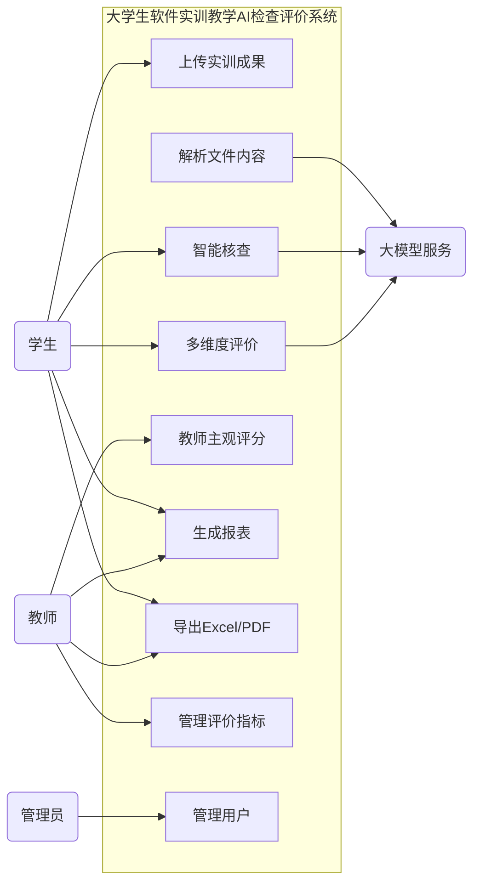
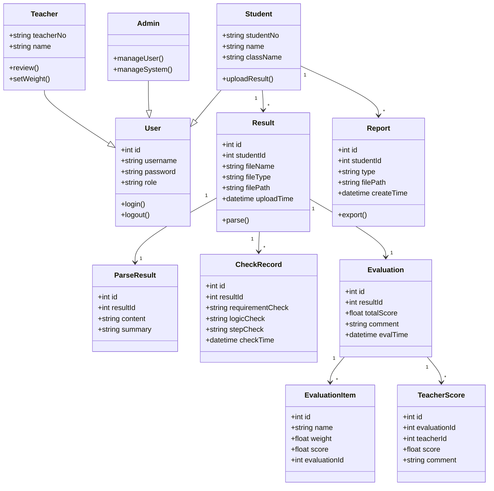
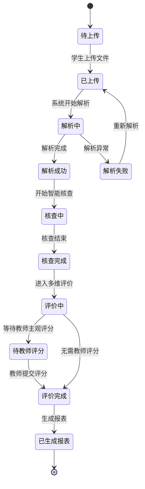

# 大学生软件实训教学AI检查评价系统 —— 需求分析文档

## 一、项目概述
本系统用于大学生软件实训教学成果的 AI 检查与评价，支持多格式成果上传、智能核查、多维度评价与报表导出。

## 二、功能模型

### 2.1 用例图

### 2.2 功能列表
| 编号 | 功能 | 使用者 | 说明 |
|------|------|--------|------|
| F1 | 成果上传 | 学生 | 支持 Word/PDF/截图 |
| F2 | 文件解析 | 系统 | 提取文本、核心信息 |
| F3 | 智能核查 | 系统 | 要求校验、逻辑漏洞、步骤完整性 |
| F4 | 多维评价 | 系统 | 自定义指标 + 权重 + 评分 |
| F5 | 教师主观评分 | 教师 | 预留评分入口 |
| F6 | 报表生成 | 系统 | 评价报告、统计报表 |
| F7 | 报表导出 | 学生/教师 | Excel / PDF |
| F8 | 指标管理 | 教师 | 增删改评价指标与权重 |
| F9 | 用户管理 | 管理员 | 用户增删改查 |

## 三、数据模型

### 3.1 类图

## 四、行为模型

### 4.1 状态转换图

## 五、数据项说明（关键点）

### 用户表 user
| 数据项 | 类型 | 长度 | 必填 | 说明 |
|--------|------|------|------|------|
| id | int | 11 | 是 | 主键 |
| username | varchar | 50 | 是 | 用户名 |
| password | varchar | 100 | 是 | 密码（加密） |
| role | varchar | 20 | 是 | student/teacher/admin |
| create_time | datetime | - | 是 | 创建时间 |

### 成果表 result
| 数据项 | 类型 | 长度 | 必填 | 说明 |
|--------|------|------|------|------|
| id | int | 11 | 是 | 主键 |
| student_id | int | 11 | 是 | 学生ID |
| file_name | varchar | 200 | 是 | 文件名 |
| file_type | varchar | 20 | 是 | word/pdf/image |
| file_path | varchar | 255 | 是 | 存储路径 |
| upload_time | datetime | - | 是 | 上传时间 |
| status | varchar | 20 | 是 | 状态 |

### 解析结果表 parse_result
| 数据项 | 类型 | 长度 | 必填 | 说明 |
|--------|------|------|------|------|
| id | int | 11 | 是 | 主键 |
| result_id | int | 11 | 是 | 成果ID |
| content | text | - | 是 | 解析文本 |
| summary | text | - | 否 | 核心信息摘要 |

### 核查记录表 check_record
| 数据项 | 类型 | 长度 | 必填 | 说明 |
|--------|------|------|------|------|
| id | int | 11 | 是 | 主键 |
| result_id | int | 11 | 是 | 成果ID |
| requirement_check | text | - | 是 | 要求校验结果 |
| logic_check | text | - | 是 | 逻辑漏洞结果 |
| step_check | text | - | 是 | 步骤完整性结果 |
| check_time | datetime | - | 是 | 核查时间 |

### 评价表 evaluation
| 数据项 | 类型 | 长度 | 必填 | 说明 |
|--------|------|------|------|------|
| id | int | 11 | 是 | 主键 |
| result_id | int | 11 | 是 | 成果ID |
| total_score | decimal | 5,2 | 是 | 总分 |
| comment | text | - | 否 | 评语 |
| eval_time | datetime | - | 是 | 评价时间 |

### 评价指标表 evaluation_item
| 数据项 | 类型 | 长度 | 必填 | 说明 |
|--------|------|------|------|------|
| id | int | 11 | 是 | 主键 |
| evaluation_id | int | 11 | 是 | 评价ID |
| name | varchar | 50 | 是 | 指标名 |
| weight | decimal | 4,2 | 是 | 权重 |
| score | decimal | 5,2 | 是 | 得分 |

### 教师评分表 teacher_score
| 数据项 | 类型 | 长度 | 必填 | 说明 |
|--------|------|------|------|------|
| id | int | 11 | 是 | 主键 |
| evaluation_id | int | 11 | 是 | 评价ID |
| teacher_id | int | 11 | 是 | 教师ID |
| score | decimal | 5,2 | 是 | 评分 |
| comment | text | - | 否 | 评语 |

### 报表表 report
| 数据项 | 类型 | 长度 | 必填 | 说明 |
|--------|------|------|------|------|
| id | int | 11 | 是 | 主键 |
| student_id | int | 11 | 是 | 学生ID |
| type | varchar | 20 | 是 | report/statistics |
| file_path | varchar | 255 | 是 | 文件路径 |
| create_time | datetime | - | 是 | 创建时间 |

## 六、非功能需求
1. 支持本地大模型或云端大模型
2. 页面响应时间 < 3 秒
3. 支持多格式文件上传
4. 报表导出支持 Excel 和 PDF
5. 权限控制：学生、教师、管理员