\# 大学生软件实训教学AI检查评价系统 —— 需求分析文档


\## 一、项目概述

本系统用于大学生软件实训教学成果的 AI 检查与评价，支持多格式成果上传、智能核查、多维度评价与报表导出。


\## 二、功能模型


\### 2.1 用例图


```mermaid

graph LR

&#x20;   Student\[学生]

&#x20;   Teacher\[教师]

&#x20;   Admin\[管理员]

&#x20;   LLM\[大模型服务]


&#x20;   subgraph 系统\[大学生软件实训教学AI检查评价系统]

&#x20;       UC1\[上传实训成果]

&#x20;       UC2\[解析文件内容]

&#x20;       UC3\[智能核查]

&#x20;       UC4\[多维度评价]

&#x20;       UC5\[教师主观评分]

&#x20;       UC6\[生成报表]

&#x20;       UC7\[导出Excel/PDF]

&#x20;       UC8\[管理评价指标]

&#x20;       UC9\[管理用户]

&#x20;   end


&#x20;   Student --> UC1

&#x20;   Student --> UC3

&#x20;   Student --> UC4

&#x20;   Student --> UC6

&#x20;   Student --> UC7


&#x20;   Teacher --> UC5

&#x20;   Teacher --> UC8

&#x20;   Teacher --> UC6

&#x20;   Teacher --> UC7


&#x20;   Admin --> UC9


&#x20;   UC2 --> LLM

&#x20;   UC3 --> LLM

&#x20;   UC4 --> LLM

```


\### 2.2 功能列表

| 编号 | 功能 | 使用者 | 说明 |

|------|------|--------|------|

| F1 | 成果上传 | 学生 | 支持 Word/PDF/截图 |

| F2 | 文件解析 | 系统 | 提取文本、核心信息 |

| F3 | 智能核查 | 系统 | 要求校验、逻辑漏洞、步骤完整性 |

| F4 | 多维评价 | 系统 | 自定义指标 + 权重 + 评分 |

| F5 | 教师主观评分 | 教师 | 预留评分入口 |

| F6 | 报表生成 | 系统 | 评价报告、统计报表 |

| F7 | 报表导出 | 学生/教师 | Excel / PDF |

| F8 | 指标管理 | 教师 | 增删改评价指标与权重 |

| F9 | 用户管理 | 管理员 | 用户增删改查 |


\## 三、数据模型


\### 3.1 类图


```mermaid

classDiagram

&#x20;   class User {

&#x20;       +int id

&#x20;       +string username

&#x20;       +string password

&#x20;       +string role

&#x20;       +login()

&#x20;       +logout()

&#x20;   }


&#x20;   class Student {

&#x20;       +string studentNo

&#x20;       +string name

&#x20;       +string className

&#x20;       +uploadResult()

&#x20;   }


&#x20;   class Teacher {

&#x20;       +string teacherNo

&#x20;       +string name

&#x20;       +review()

&#x20;       +setWeight()

&#x20;   }


&#x20;   class Admin {

&#x20;       +manageUser()

&#x20;       +manageSystem()

&#x20;   }


&#x20;   class Result {

&#x20;       +int id

&#x20;       +int studentId

&#x20;       +string fileName

&#x20;       +string fileType

&#x20;       +string filePath

&#x20;       +datetime uploadTime

&#x20;       +parse()

&#x20;   }


&#x20;   class ParseResult {

&#x20;       +int id

&#x20;       +int resultId

&#x20;       +string content

&#x20;       +string summary

&#x20;   }


&#x20;   class CheckRecord {

&#x20;       +int id

&#x20;       +int resultId

&#x20;       +string requirementCheck

&#x20;       +string logicCheck

&#x20;       +string stepCheck

&#x20;       +datetime checkTime

&#x20;   }


&#x20;   class Evaluation {

&#x20;       +int id

&#x20;       +int resultId

&#x20;       +float totalScore

&#x20;       +string comment

&#x20;       +datetime evalTime

&#x20;   }


&#x20;   class EvaluationItem {

&#x20;       +int id

&#x20;       +string name

&#x20;       +float weight

&#x20;       +float score

&#x20;       +int evaluationId

&#x20;   }


&#x20;   class TeacherScore {

&#x20;       +int id

&#x20;       +int evaluationId

&#x20;       +int teacherId

&#x20;       +float score

&#x20;       +string comment

&#x20;   }


&#x20;   class Report {

&#x20;       +int id

&#x20;       +int studentId

&#x20;       +string type

&#x20;       +string filePath

&#x20;       +datetime createTime

&#x20;       +export()

&#x20;   }


&#x20;   User <|-- Student

&#x20;   User <|-- Teacher

&#x20;   User <|-- Admin

&#x20;   Student "1" --> "\*" Result

&#x20;   Result "1" --> "1" ParseResult

&#x20;   Result "1" --> "\*" CheckRecord

&#x20;   Result "1" --> "1" Evaluation

&#x20;   Evaluation "1" --> "\*" EvaluationItem

&#x20;   Evaluation "1" --> "\*" TeacherScore

&#x20;   Student "1" --> "\*" Report

```


\## 四、行为模型


\### 4.1 状态转换图

```mermaid

stateDiagram-v2

&#x20;   \[\*] --> 待上传

&#x20;   待上传 --> 已上传: 学生上传文件

&#x20;   已上传 --> 解析中: 系统开始解析

&#x20;   解析中 --> 解析成功: 解析完成

&#x20;   解析中 --> 解析失败: 解析异常

&#x20;   解析失败 --> 已上传: 重新解析

&#x20;   解析成功 --> 核查中: 开始智能核查

&#x20;   核查中 --> 核查完成: 核查结束

&#x20;   核查完成 --> 评价中: 进入多维评价

&#x20;   评价中 --> 待教师评分: 等待教师主观评分

&#x20;   待教师评分 --> 评价完成: 教师提交评分

&#x20;   评价中 --> 评价完成: 无需教师评分

&#x20;   评价完成 --> 已生成报表: 生成报表

&#x20;   已生成报表 --> \[\*]

```





\## 五、数据项说明（关键点）


\### 用户表 user

| 数据项 | 类型 | 长度 | 必填 | 说明 |

|--------|------|------|------|------|

| id | int | 11 | 是 | 主键 |

| username | varchar | 50 | 是 | 用户名 |

| password | varchar | 100 | 是 | 密码（加密） |

| role | varchar | 20 | 是 | student/teacher/admin |

| create\_time | datetime | - | 是 | 创建时间 |


\### 成果表 result

| 数据项 | 类型 | 长度 | 必填 | 说明 |

|--------|------|------|------|------|

| id | int | 11 | 是 | 主键 |

| student\_id | int | 11 | 是 | 学生ID |

| file\_name | varchar | 200 | 是 | 文件名 |

| file\_type | varchar | 20 | 是 | word/pdf/image |

| file\_path | varchar | 255 | 是 | 存储路径 |

| upload\_time | datetime | - | 是 | 上传时间 |

| status | varchar | 20 | 是 | 状态 |


\### 解析结果表 parse\_result

| 数据项 | 类型 | 长度 | 必填 | 说明 |

|--------|------|------|------|------|

| id | int | 11 | 是 | 主键 |

| result\_id | int | 11 | 是 | 成果ID |

| content | text | - | 是 | 解析文本 |

| summary | text | - | 否 | 核心信息摘要 |


\### 核查记录表 check\_record

| 数据项 | 类型 | 长度 | 必填 | 说明 |

|--------|------|------|------|------|

| id | int | 11 | 是 | 主键 |

| result\_id | int | 11 | 是 | 成果ID |

| requirement\_check | text | - | 是 | 要求校验结果 |

| logic\_check | text | - | 是 | 逻辑漏洞结果 |

| step\_check | text | - | 是 | 步骤完整性结果 |

| check\_time | datetime | - | 是 | 核查时间 |


\### 评价表 evaluation

| 数据项 | 类型 | 长度 | 必填 | 说明 |

|--------|------|------|------|------|

| id | int | 11 | 是 | 主键 |

| result\_id | int | 11 | 是 | 成果ID |

| total\_score | decimal | 5,2 | 是 | 总分 |

| comment | text | - | 否 | 评语 |

| eval\_time | datetime | - | 是 | 评价时间 |


\### 评价指标表 evaluation\_item

| 数据项 | 类型 | 长度 | 必填 | 说明 |

|--------|------|------|------|------|

| id | int | 11 | 是 | 主键 |

| evaluation\_id | int | 11 | 是 | 评价ID |

| name | varchar | 50 | 是 | 指标名 |

| weight | decimal | 4,2 | 是 | 权重 |

| score | decimal | 5,2 | 是 | 得分 |


\### 教师评分表 teacher\_score

| 数据项 | 类型 | 长度 | 必填 | 说明 |

|--------|------|------|------|------|

| id | int | 11 | 是 | 主键 |

| evaluation\_id | int | 11 | 是 | 评价ID |

| teacher\_id | int | 11 | 是 | 教师ID |

| score | decimal | 5,2 | 是 | 评分 |

| comment | text | - | 否 | 评语 |


\### 报表表 report

| 数据项 | 类型 | 长度 | 必填 | 说明 |

|--------|------|------|------|------|

| id | int | 11 | 是 | 主键 |

| student\_id | int | 11 | 是 | 学生ID |

| type | varchar | 20 | 是 | report/statistics |

| file\_path | varchar | 255 | 是 | 文件路径 |

| create\_time | datetime | - | 是 | 创建时间 |


\## 六、非功能需求

1\. 支持本地大模型或云端大模型

2\. 页面响应时间 < 3 秒

3\. 支持多格式文件上传

4\. 报表导出支持 Excel 和 PDF

5\. 权限控制：学生、教师、管理员

